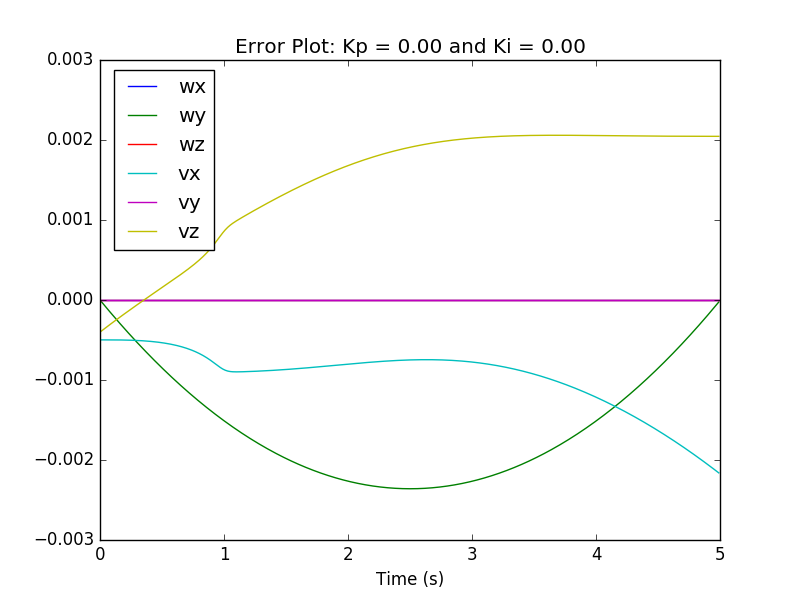
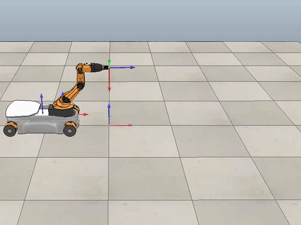
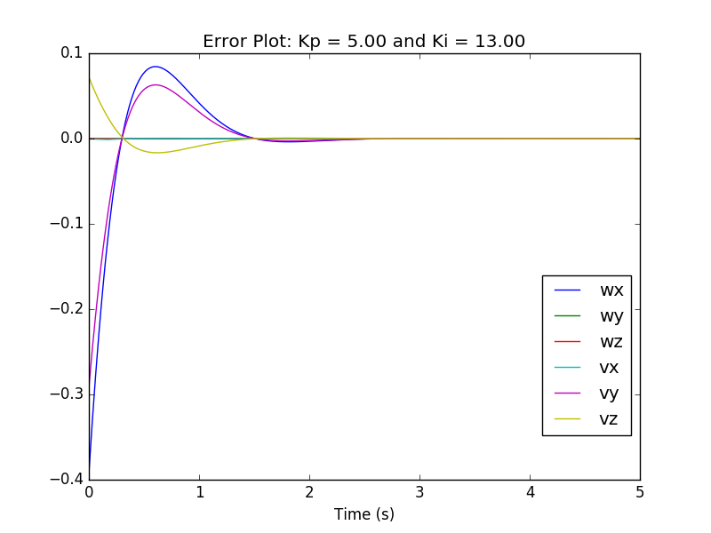
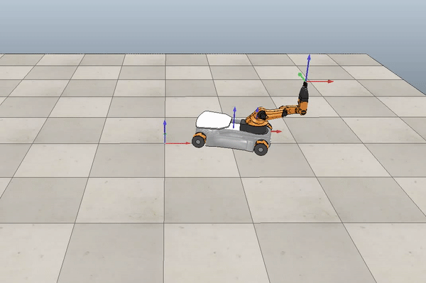
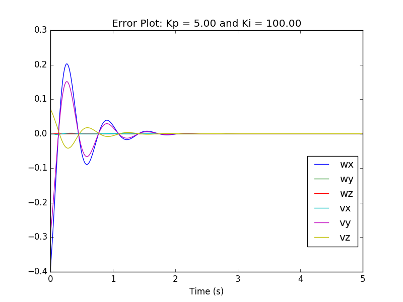
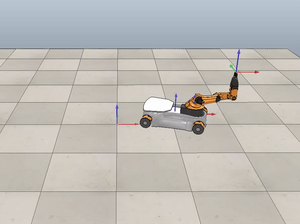

## Wheeled Mobile Manipulation of KUKA youBot
**Michael Wiznitzer**

Northwestern University ME 449: Robotic Manipulation (Fall 2017)

## Introduction
#### Objective
To move the end-effector of the KUKA youBot from its current configuration to a desired configuration.

#### General Steps
1. Get the robot's current configuration ***X*** using forward kinematics. Initial joint conditions are provided in the problem.
2. Get the robot's desired configuration ***Xd*** and twist ***Vd***. The desired configuration is determined from a path ***Xd(s)*** provided by the problem where ***s*** is the the cubic time scaling from ***t = 0*** to ***t = 5***. The desired twist is determined using ***Xd*** and its derivative.
3. Calculate the error between the desired and current configuration.
4. Evaluate the control law to find the commanded end-effector twist ***V***.
5. Calculate the commanded wheel and joint velocities using the pseudo-inverse of the end-effector Jacobian multiplied by the commanded end-effector twist.
6. Calculate the body twist of the chassis ***Vb*** using the commanded wheel velocities and Odometry of the four-mecanum-wheel robot.
5. Update the robot's current chassis and joint configuration, and wheel positions using the new commanded chassis, joint, and wheel velocities and a 0.01 second time step.

## Results
#### Feedforward only with inital conditions already on the desired path.
The error plot is shown below. As can be seen, the error starts very small since the robot starts on the path. Overall, the error is really small compared to the other plots, since the robot starts on the path.

A demo is shown below.

#### Feedforward + PI Control with inital conditions not on the desired path.
The error plot is shown below. As can be seen, the 2% settling time is a little bit after 1.5 seconds, which is within the 2 seconds required by the problem. It can also be seen that there is one main overshoot which can be seen in the video at the beginning of the demo.

A demo is shown below.

#### Feedforward + PI Control with inital conditions not on the desired path.
The error plot is shown below. As can be seen, the overshoot is much bigger and there are more oscillations than the previous plot. This is because the Ki gain is very big which means that the imaginary parts of the roots will be much larger than in the previous demo. Looking at the root locus plot, we know that the higher the imaginary roots, the higher the overshoot and number of oscillations. So this plot makes sense from what we conceptually know about control theory. Furthermore, these oscillations can be seen in the video which confirms that the demo is working right.

A demo is shown below.

